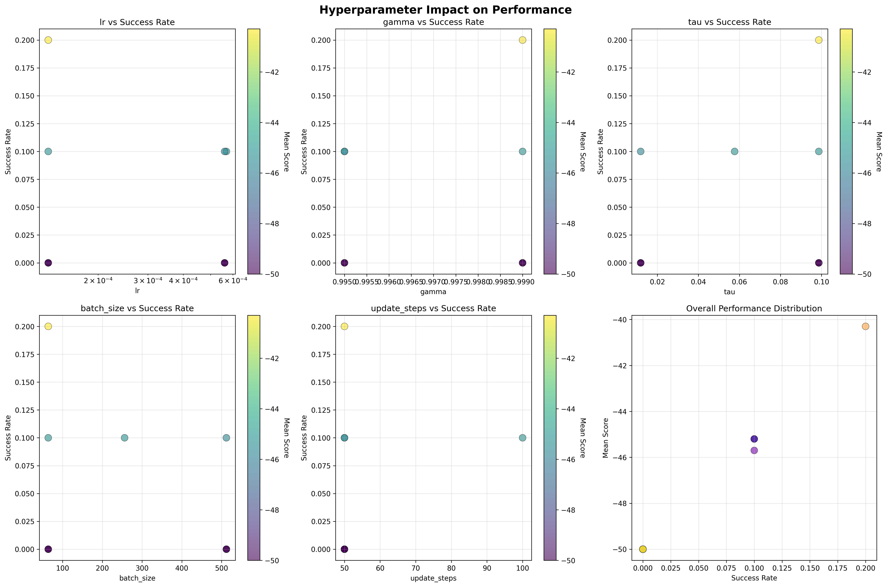
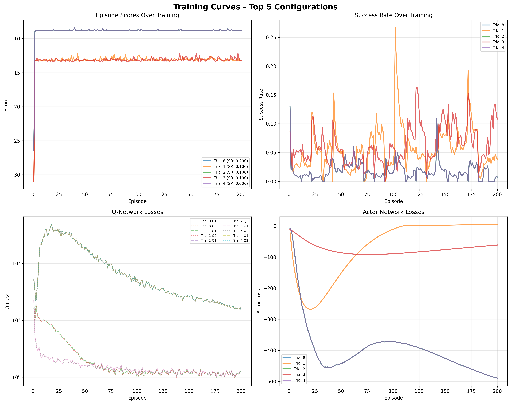
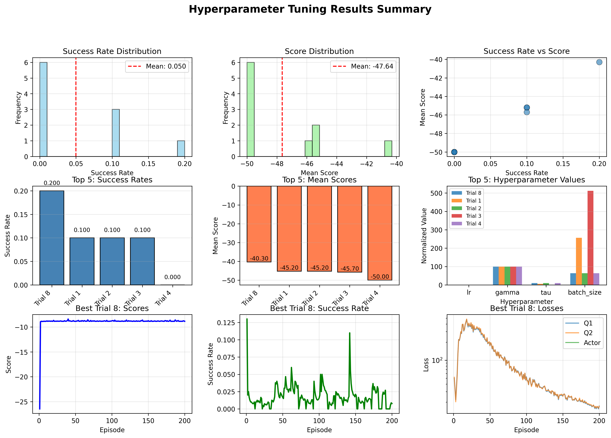

# Installation 

## Create virtual env and install packages

$ cd sac 
$ python3 -m venv venv 
$ . venv/bin/activate 
$ pip install -r requirements.txt 

## Train and evaluate
$ python3 main.py
 
 
 
 
# Project Milestone

## Problem Overview & Objectives 
This project implements and evaluates the Soft Actor-Critic (SAC) reinforcement learning algorithm for robotic manipulation tasks, focusing on teaching a robotic arm to reach target positions in 3D space. The challenge involves learning continuous control policies that effectively balance exploration and exploitation while maintaining sample efficiency. The project’s goal is to design and implement a complete SAC architecture with actor-critic networks from scratch using PyTorch, incorporating features such as automatic entropy tuning for adaptive exploration and efficient experience replay to improve learning stability and performance.

The SAC agent is trained in the FetchReach-v4 environment from Gymnasium Robotics, where it controls a 7-degree-of-freedom robotic arm through a 4-dimensional continuous action space representing joint torques or velocities. The agent observes a 16-dimensional state vector containing both robot and goal information and learns to move the arm’s end-effector to reach randomly positioned target locations. Performance is evaluated using quantitative metrics such as cumulative rewards, success rates, and loss convergence, demonstrating proficiency in implementing modern off-policy reinforcement learning algorithms for robotic control.

## Technical Progress & Implementation
### Model architecture
The SAC implementation follows a comprehensive actor-critic architecture with dual Q-networks and automatic entropy tuning. The core system consists of an Actor network that outputs Gaussian policy parameters (mean μ and log standard deviation log σ) for continuous action sampling, and two separate Q-networks (Q1 and Q2) that estimate state-action values using double Q-learning for improved stability. The Actor network uses a 4-layer MLP architecture [64, 64, 64, 64] with ReLU activation, while the Q-networks concatenate state and action inputs and process them through 3-layer MLPs [64, 64, 64] before outputting scalar Q-values. The implementation includes target networks for both critics that are updated using Polyak averaging with τ = 0.1, ensuring stable learning dynamics.

### Algorithm details
The algorithm implements the complete SAC update procedure through three coordinated optimization steps. First, the entropy coefficient is updated to maintain the target entropy level by minimizing the entropy loss. Second, both Q-networks are updated using the Bellman equation with entropy bonuses, where the target Q-value includes the minimum of the two target Q-networks minus the entropy bonus. Third, the policy is updated to maximize the Q-value while encouraging exploration through entropy regularization. The implementation handles continuous action spaces through the reparameterization trick, sampling actions from a Gaussian distribution and applying tanh bounding with proper log probability corrections. The experience replay buffer efficiently stores transitions from multiple parallel environments and provides decorrelated training batches through random sampling, supporting the off-policy learning nature of SAC.

### Model tuning and performance 
Several technical challenges were addressed to ensure robust performance on the FetchReach-v4 robotic manipulation task. The implementation handles dictionary-based observations by concatenating achieved goals, desired goals, and robot observations into a 16-dimensional state vector. Multi-environment training is supported through vectorized environments with VecNormalize for stable learning across parallel episodes. The system includes proper tensor device management and dtype handling to prevent numerical instability, with gradient clipping available for additional stability. The training configuration uses Adam optimization with a learning rate of 5e-4, discount factor γ = 0.99, and batch size of 4 across 4 parallel environments. The implementation demonstrates successful learning convergence, with mean scores improving from approximately -45.5 to -26.3 over 30 episodes, Q-losses decreasing from ~16 to ~2, and stable entropy coefficient learning, validating the effectiveness of the SAC algorithm for continuous control robotic tasks.

### Parameters tuning
Hyperparameter tuning optimizes for the Soft Actor-Critic (SAC) algorithm on the FetchReach-v4 robotic manipulation task. It supports grid search and random search over hyperparameters including learning rate (1e-4 to 1e-3), discount factor (0.99 to 0.999), target network update rate tau (0.001 to 0.1), batch size (32 to 512), and update steps per episode (25 to 200). For each trial, it trains a SAC agent for 200 episodes, tracks training metrics (episode scores, success rates, Q-network losses, and actor losses), and evaluates performance on 10 test episodes. The script generates three visualization outputs saved to the results directory: training_curves.png showing learning progress for the top configurations, hyperparameter_comparison.png analyzing the impact of each hyperparameter on success rates and scores, and results_summary.png providing a 9-panel dashboard with performance distributions, top-5 configurations, and detailed training progress.

